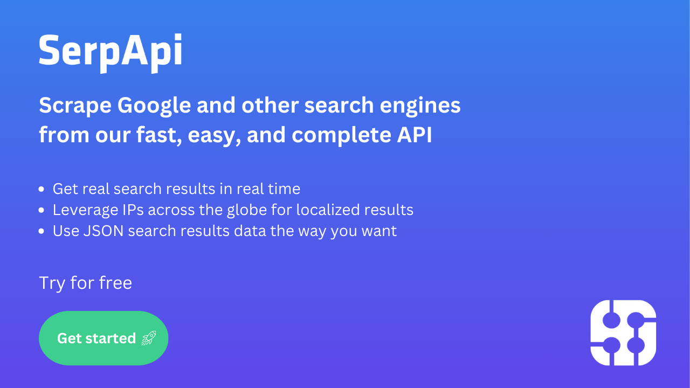
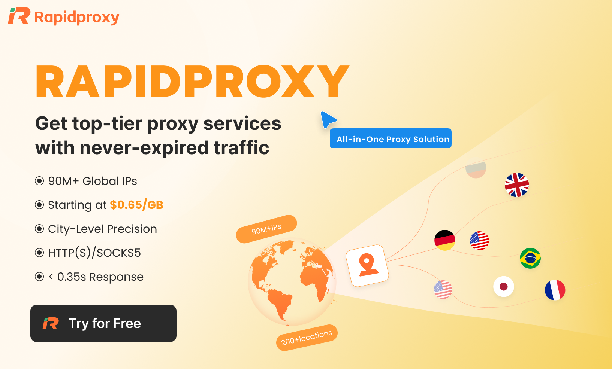

# Sponsoring Public API Lists

Thank you for considering sponsoring this project! Your support helps us maintain and grow a community-curated list of free public APIs.

## Why Sponsor?

- **13,700+ GitHub stars** — high visibility among developers worldwide
- **Thousands of daily visitors** looking for APIs to build with
- **Permanent placement** in a widely-referenced developer resource
- **Direct exposure** to your target audience: developers and engineering teams

## Sponsor Tiers

### 🥇 Gold Sponsor — $200/month

- **Large logo** displayed prominently in the README sponsors section
- **Company name + one-line description** below the logo
- **Link to your website** with UTM tracking
- Limited to **4 Gold sponsors** to maintain value

### 🥈 Silver Sponsor — $100/month

- **Medium logo** (150px) in the README sponsors section
- **Link to your website** with UTM tracking
- Limited to **8 Silver sponsors**

### 🥉 Bronze Sponsor — $50/month

- **Text link** with company name in the README sponsors section
- Limited to **12 Bronze sponsors**

## How to Become a Sponsor

1. **GitHub Sponsors** (preferred): [Sponsor via GitHub](https://github.com/sponsors/public-api-lists)
2. **Direct contact**: [Start a discussion](https://github.com/public-api-lists/public-api-lists/discussions/new?category=sponsor-inquiries&title=[Sponsor]%20) in our Discussions tab

## Sponsor Guidelines

- Sponsors must offer a product or service **relevant to developers**
- We reserve the right to decline sponsorships that don't align with the project's values
- Sponsorship does not guarantee inclusion of your API in the list — the list is community-curated
- Sponsor placements are in the dedicated sponsors section only, **not within the API tables**

## Current Sponsors

### 🥇 Gold

**[SerpApi](https://serpapi.com/?utm_source=public-api-lists)** — Scrape Google and other search engines with a simple API

**[RapidProxy](https://www.rapidproxy.io/?ref=public)** — Power your data collection and automation with 90M+ reliable residential proxies built for scale

### 🥈 Silver

**[Atlas Cloud](https://www.atlascloud.ai/)** — AI API aggregation platform with OpenAI-compatible chat completions, image and video generation

### 🥉 Bronze
*Open slots available*

---

*Thank you for supporting open source!*
